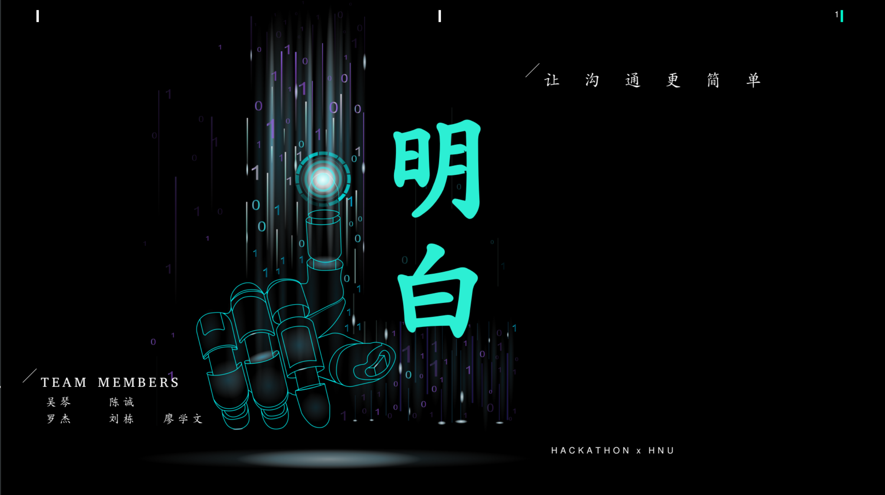
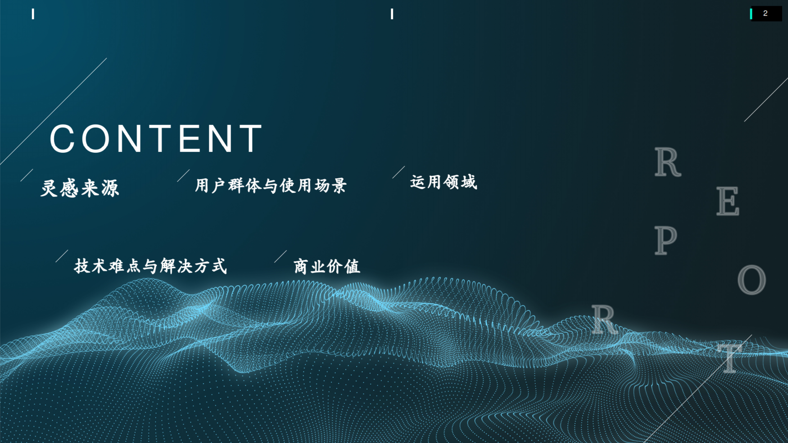
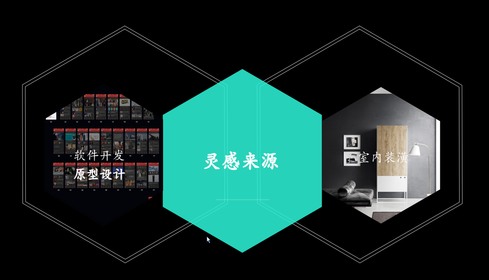
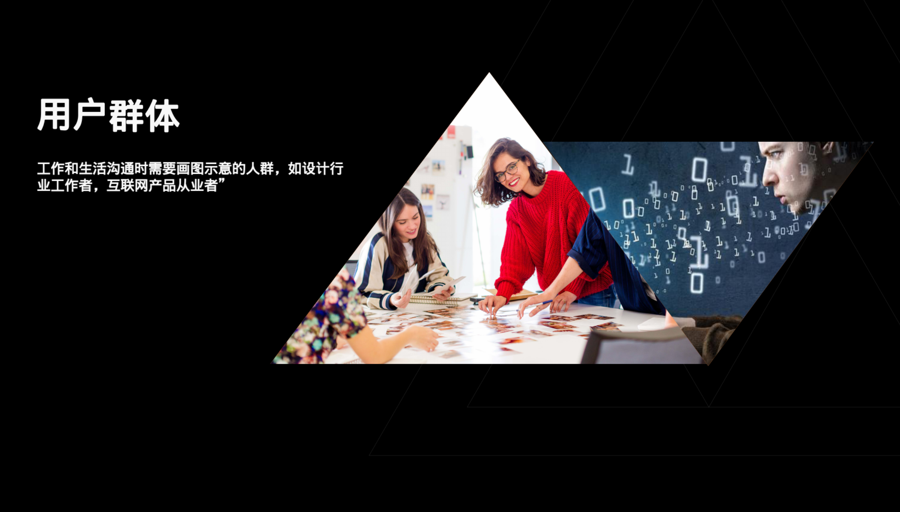
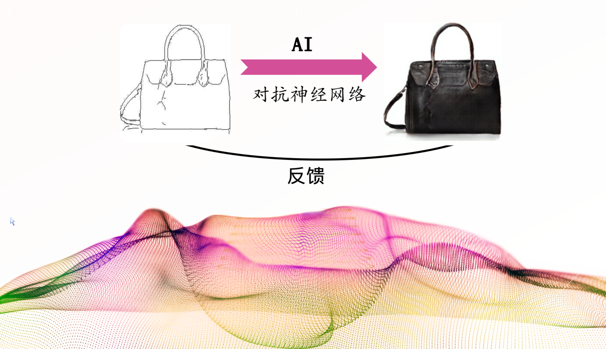
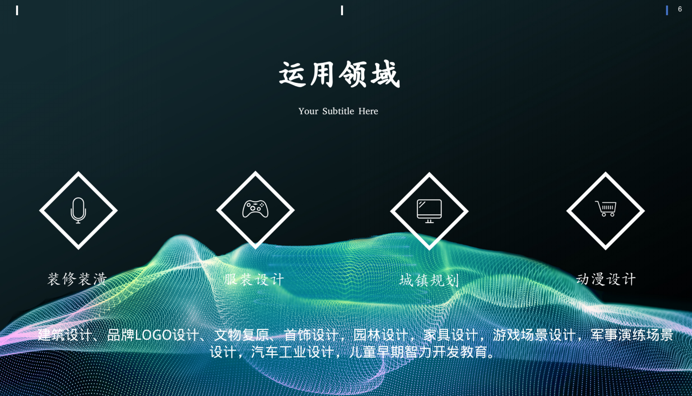
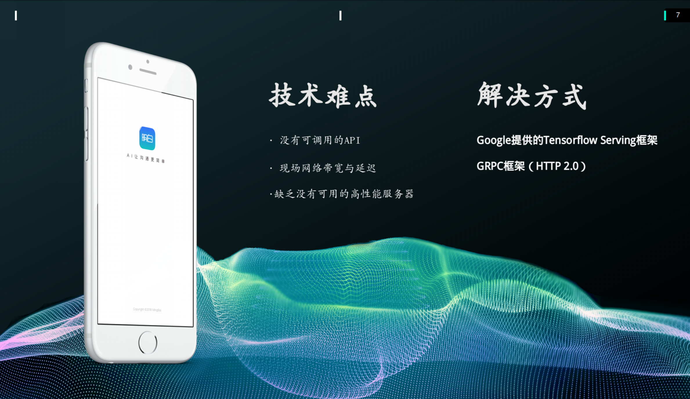

# HACK_GAN_img2img

      


 

Based on [pix2pix](https://phillipi.github.io/pix2pix/) by Isola et al.

### PAPER
[Image-to-Image Translation with Conditional Adversarial Nets](https://arxiv.org/abs/1611.07004) [CVPR 2017]

### HACKX
[Project URL](https://www.hackx.org/projects/299)

### TEAM NAME
取个名字真TM难

### AUTHOR
+ [XueWenLiao](https://github.com/XuewenLiao) 
+ ChengChen 
+ [LuoJie](https://github.com/luojie1024)
+ [LiuDong](https://github.com/1mrliu)  
+ [WuQin](https://www.zhihu.com/people/jessiewu-qin/activities) [`Surprise Scene`](https://changba.com/wap/index.php?s=M89dzpF8OTcFqbT_3Qhnyw)

### PREREQUISITES
- Android 7.0
- Tensorflow 1.4.1 
- Django 2.0.5
- djangorestframework 3.8.2  

### CODE

|[Client](https://github.com/XuewenLiao/PaintSole)|[Server](https://github.com/luojie1024/HACK_GAN_MB)|
-|-

 

### RECOMMENDED
- Linux with Tensorflow GPU edition + cuDNN

### DESCRIPTION
> Based on GAN technology, quickly transform your own ideas into images and improve communication efficiency. First, use Tensorflow to build GAN models. Second, encapsulate models into functions. Third, use Django framework to build servers and provide APIs for clients to use. The fourth use of Android to build a client. GAN neural network will be hand-drawn sketches of the user into a very realistic picture.

### LOGO
<div align=center></div>

### PHOTOS

<div align=center></div>

<div align=center></div>

<div align=center></div>

<div align=center></div>

<div align=center></div>

<div align=center></div>

<div align=center></div>

<div align=center></div>

<div align=center></div>

<div align=center></div>

### FEATURES DESCRIPTION
##### Painting:
1. Hand-Painted:  users can freely go to paint, without any restrictions.
2. Eraser: erase the wrong part.
3. Line: users can only use the line to draw.
4. Revocation: Users can undo the previous step.
5. Empty: the user can empty the drawing board.
6. Generate a picture: Save the picture.

##### MODEL:

1. Building model: Users can use five label components: walls, doors, windows, eaves and room pillars to help draw.

2. Street View Model: Users can use five label components: roads, lawns, cars, trees, and street lights to help draw.

3. Package Model: the user draws the package.

4. Shoe Model: the user draws shoes.

### VIEDO
[DEMO URL](https://www.bilibili.com/video/av23990741/)


### SLIDE DECK
<div align=center></div>

<div align=center></div>

<div align=center></div>

<div align=center></div>

<div align=center></div>

<div align=center></div>

<div align=center></div>

<div align=center></div>

## Setup

### Getting Started

#### step1:
```
# clone this repo
git clone git@github.com:luojie1024/HACK_GAN_img2img.git
cd HACK_GAN_MB
```

#### step2:
```
python manage.py runserver
```

[Server Settings](https://blog.csdn.net/luojie140/article/details/76832749)

### DataSet
### Please use the download_dataset.sh shell scripts to solve dataset can't be download problem!
| dataset | example |
| --- | --- |
| `python tools/download-dataset.py facades` <br> 400 images from [CMP Facades dataset](http://cmp.felk.cvut.cz/~tylecr1/facade/). (31MB) <br> Pre-trained: [BtoA](https://mega.nz/#!H0AmER7Y!pBHcH4M11eiHBmJEWvGr-E_jxK4jluKBUlbfyLSKgpY)  |  |
| `python tools/download-dataset.py cityscapes` <br> 2975 images from the [Cityscapes training set](https://www.cityscapes-dataset.com/). (113M) <br> Pre-trained: [AtoB](https://mega.nz/#!K1hXlbJA!rrZuEnL3nqOcRhjb-AnSkK0Ggf9NibhDymLOkhzwuQk) [BtoA](https://mega.nz/#!y1YxxB5D!1817IXQFcydjDdhk_ILbCourhA6WSYRttKLrGE97q7k) |  |
| `python tools/download-dataset.py maps` <br> 1096 training images scraped from Google Maps (246M) <br> Pre-trained: [AtoB](https://mega.nz/#!7oxklCzZ!8fRZoF3jMRS_rylCfw2RNBeewp4DFPVE_tSCjCKr-TI) [BtoA](https://mega.nz/#!S4AGzQJD!UH7B5SV7DJSTqKvtbFKqFkjdAh60kpdhTk9WerI-Q1I) |  |
| `python tools/download-dataset.py edges2shoes` <br> 50k training images from [UT Zappos50K dataset](http://vision.cs.utexas.edu/projects/finegrained/utzap50k/). Edges are computed by [HED](https://github.com/s9xie/hed) edge detector + post-processing. (2.2GB) <br> Pre-trained: [AtoB](https://mega.nz/#!u9pnmC4Q!2uHCZvHsCkHBJhHZ7xo5wI-mfekTwOK8hFPy0uBOrb4) |   |
| `python tools/download-dataset.py edges2handbags` <br> 137K Amazon Handbag images from [iGAN project](https://github.com/junyanz/iGAN). Edges are computed by [HED](https://github.com/s9xie/hed) edge detector + post-processing. (8.6GB) <br> Pre-trained: [AtoB](https://mega.nz/#!G1xlDCIS!sFDN3ZXKLUWU1TX6Kqt7UG4Yp-eLcinmf6HVRuSHjrM) |  |

The `facades` dataset is the smallest and easiest to get started with.
